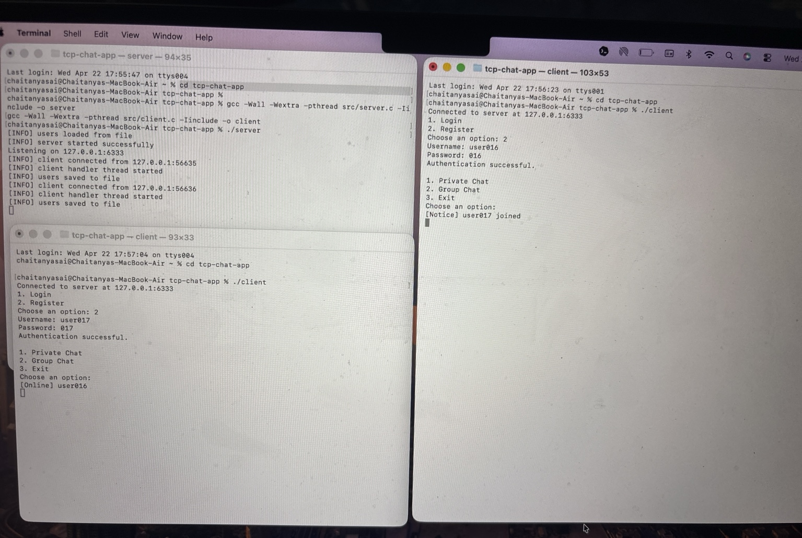
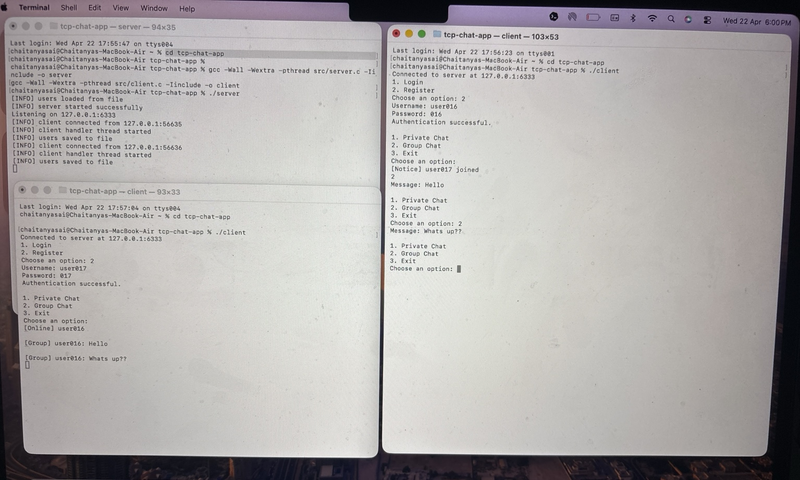

# TCP Chat Application (C)

A multi-client chat application using TCP sockets and pthreads.

## Features
- User Login & Registration
- Private Chat
- Group Chat
- Online Users List
- Multi-client support using threads

## Tech Used
- C
- POSIX Sockets
- pthreads

## How to Run

### Compile
gcc -Wall -Wextra -pthread src/server.c -Iinclude -o server  
gcc -Wall -Wextra -pthread src/client.c -Iinclude -o client  

### Run Server
./server

### Run Client
./client

## Project Structure
tcp-chat-app/
├── src/
│   ├── server.c
│   └── client.c
├── include/
│   └── common.h
├── users.txt
└── README.md

## Author
Chaitanya Sai

## How it works

- Server listens on a TCP socket
- Each client connects and runs on a separate thread
- Messages are exchanged using structured frames
- Active users are managed using a linked list

## Demo

## Screenshots

### Server + Client Setup

### Chat Output
